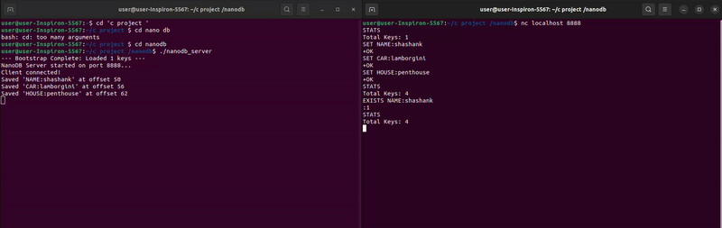

## 🛠 The Engineering Behind NanoDB

I built NanoDB to explore how databases like Redis and Bitcask handle data at the low level. Here’s the technical breakdown of the two core systems:

### 1. The Storage Engine (Append-Only Log)
Most people think databases "rewrite" files when data changes. NanoDB doesn't. It uses an **Append-Only Log**.

* **The Logic:** Writing to the end of a file is much faster than searching and replacing text in the middle. 
* **Persistence:** Every `SET` command tacks new data onto the end of the `.db` file using binary `fwrite`. This ensures data survives crashes or power loss.


### 2. The Index (Hash Table Memory)
To keep lookups instant ($O(1)$), I implemented a **Hash Table** in RAM. 

* **The Hashing:** When you ask for a key like `user:1`, NanoDB runs it through the **DJB2 algorithm**. This turns the string into a unique integer index.
* **The Jump:** Instead of looping through every key, the program jumps straight to the calculated index.
* **The Offset:** The Hash Table stores the **file offset** (the exact byte position). One `fseek()` jump and the data is retrieved.


### 3. The Protocol (TCP/IP)
NanoDB operates as a server using **TCP Sockets**.
* **Stateless Communication:** Commands are sent as raw strings.
* **Response Codes:** Uses structured responses (e.g., `+OK` for success, `:1` for true) to make the communication predictable for client applications.


## 🚀 Quick Start

Want to see it in action? Follow these steps to get the server running and talk to it from your terminal.

### 1. Build and Run the Server
```bash
gcc server.c storage.c -o nanodb_server
./nanodb_server   
do this in one terminal

### 2. nc localhost 8888
 make an another terminal and run this comannd


### 3.
Try these commands:

Store data: SET user:1 shashank -> returns +OK

Retrieve data: GET user:1 -> returns shashank

Check existence: EXISTS user:1 -> returns :1

See stats: STATS -> returns Total Keys: 1


## working demo 

<p align="center">
  
</p>
